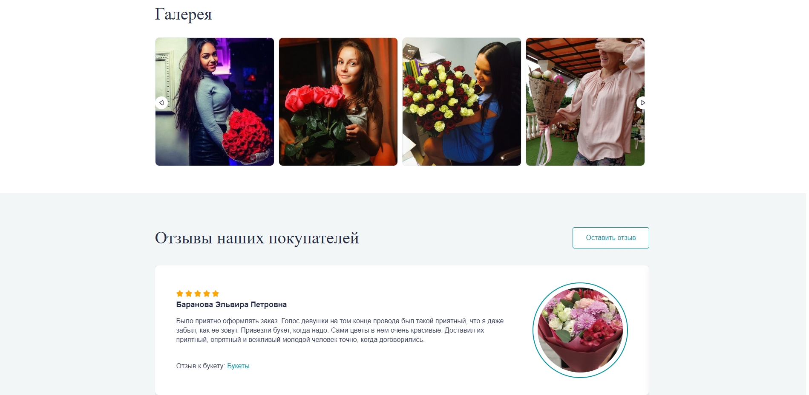
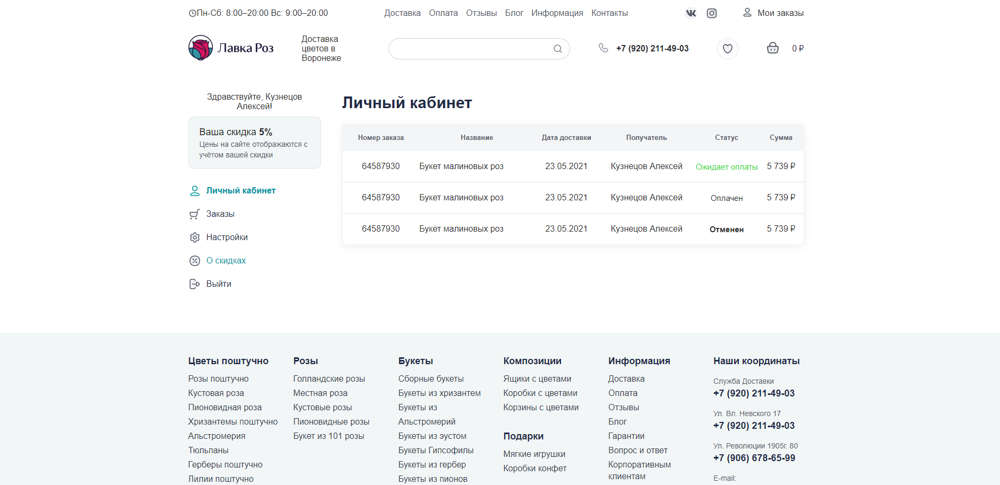
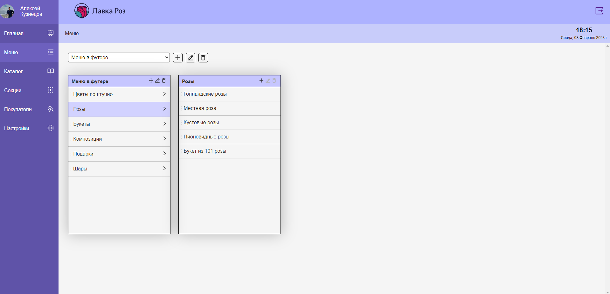

## Description
Marketplace of flowers 

## Stack
NestJS/Next.js/TypeScript, GraphQL, PostgreSQL, Formik
<br>
##### Main page

<br>

<br> 
##### Category page

<br>
##### Product page

<br>
##### Authorization page

<br>
##### Profile page

<br>

## Start
#####WARNING !!!
To start the project correctly, you need:
1. Before the first launch, you need to remove directory 'database_postgresql' from the project, after saving it in another place
2. In the terminal:   **$ docker-compose up --build**
(wait for the project to load completely, the message 'server start on port = 5000' should appear, an empty database will be installed in the container)
3. Exit Docker (press CTRL+C in the terminal
4. The 'database_postgresql' folder will appear in the root of the project. In this directory, you need to add data from the previously deleted directory 'database_postgresql'. When adding, you need to do overwrite all files and directories
5. Restart project via Docker. In the terminal:   **$ docker-compose up --build**
6. Project launched successfully. It has database tables. You can create/delete/edit data. Then at the next launches use the command:
```bash
$ docker-compose up --build
```

<br> 

To manage the database follow the link http://localhost:5050
**login:** admin@admin.com
**password:** root
You need to register the server. Specify a name, on the connection tab: Host name/address = database, Port = 5432, Maintenance database = postgres, Username = postgres, Password = root
You have access to the 'marketplace-flowers' database

<br> 


Follow the link http://localhost:3000 in a browser
To access the admin panel follow the link http://localhost:3000/admin




## Contact

- Telegram - [@alexsmith_proff](http://t.me/@alexsmith_proff)
- Email - alexsmith_proff@mail.ru